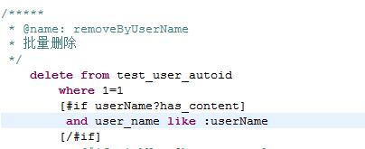
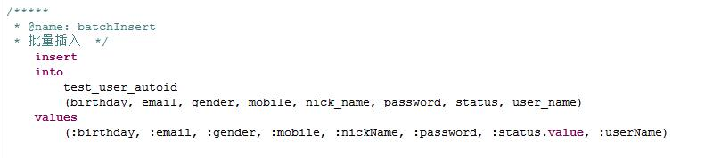

#dbm#
------
基于spring jdbc实现的简单orm   
交流群：  8060215

##特色
- 基本的实体增删改查（单表）不需要生成样板代码和sql文件。
- 返回结果不需要手动映射，会根据字段名称自动映射。
- 支持sql语句和接口绑定风格的DAO，但sql不是写在丑陋的xml里，而是直接写在sql文件里，这样用eclipse或者相关支持sql的编辑器打开时，就可以语法高亮，更容易阅读。
- 支持sql脚本修改后重新加载
- 内置支持分页查询。
- 接口支持批量插入
- Java8不需要使用类似@Param注解标识参数
- 提供充血模型支持

   

##maven
```xml

<dependency>
    <groupId>org.onetwo4j</groupId>
    <artifactId>onetwo-dbm</artifactId>
    <version>4.3.6</version>
</dependency>

```
##启用
如果是基于onetwo本框架的使用，已利用boot的autoconfig功能自动集成，无需任何配置。  
如果是非onetwo的项目，只需要在spring配置类（即有@Configuration注解的类）上加上注解@EnableJFishDbm，以启用dbm功能。
```java     
  
	@EnableDbm
	public class TestContextConfig {
	}   
   
```

##实体映射
```java   
@Entity   
@Table(name="TEST_USER_AUTOID")   
public class UserAutoidEntity {

	@Id
	@GeneratedValue(strategy=GenerationType.IDENTITY) 
	@Column(name="ID")
	protected Long id;
	@Length(min=1, max=50)
	protected String userName;
	@Length(min=0, max=50)
	@Email
	protected String email;
	protected String mobile;
	protected UserStatus status;

	//省略getter和setter
}   
```   
###注意这里用到了一些jpa的注解，含义和jpa一致：
- @Entity，表示这是一个映射到数据库表的实体
- @Table，表示这个实体映射的表
- @Id，表示这是一个主键字段
- @GeneratedValue(strategy=GenerationType.IDENTITY)，表示这个主键的值用数据库自增的方式生成，dbm目前只支持IDENTITY和SEQUENCE两种方式      
- @Column，表示映射到表的字段，一般用在java的字段名和表的字段名不对应的时候   

java的字段名使用驼峰的命名风格，而数据库使用下划线的风格，dbm会自动做转换   
注意dbm并没有实现jpa规范，只是借用了几个jpa的注解，纯属只是为了方便。。。
后来为了证明我也不是真的很懒，也写了和@Entity、@Table、@Column对应的注解，分别是：@DbmEntity（@Entity和@Table合一），@DbmColumn。。。

##BaseEntityManager接口
大多数数据库操作都可以通过BaseEntityManager接口来完成。   
BaseEntityManager可直接注入。   
```java    

	
	@Resource
	private BaseEntityManager entityManager;

	@Test
	public void testSample(){
		UserAutoidEntity user = new UserAutoidEntity();
		user.setUserName("dbm");
		user.setMobile("1333333333");
		user.setEmail("test@test.com");
		user.setStatus(UserStatus.NORMAL);
		
		//save
		Long userId = entityManager.save(user).getId();
		assertThat(userId, notNullValue());
		
		//update
		String newMobile = "13555555555";
		user.setMobile(newMobile);
		entityManager.update(user);
		
		//fetch by id
		user = entityManager.findById(UserAutoidEntity.class, userId); 
		assertThat(user.getMobile(), is(newMobile));
		
		//find one by properties
		user = entityManager.findOne(UserAutoidEntity.class, 
										"mobile", newMobile,
										"status", UserStatus.NORMAL);
		assertThat(user.getId(), is(userId));
		
		//user querys dsl api
		UserAutoidEntity queryUser = Querys.from(entityManager, UserAutoidEntity.class)
											.where()
												.field("mobile").is(newMobile)
												.field("status").is(UserStatus.NORMAL)
											.end()
											.toQuery()
											.one();
		assertThat(queryUser, is(user));
		
	}
```

##CrudEntityManager接口
CrudEntityManager是在BaseEntityManager基础上封装crud的接口，是给喜欢简单快捷的人使用的。   
CrudEntityManager实例可在数据源已配置的情况下通过简单的方法获取：

```java   
@Entity   
@Table(name="TEST_USER_AUTOID")   
public class UserAutoidEntity {

	final static public CrudEntityManager<UserAutoidEntity, Long> crudManager = Dbms.newCrudManager(UserAutoidEntity.class);

	@Id
	@GeneratedValue(strategy=GenerationType.IDENTITY) 
	@Column(name="ID")
	protected Long id;
	@Length(min=1, max=50)
	protected String userName;
	@Length(min=0, max=50)
	@Email
	protected String email;
	protected String mobile;
	protected UserStatus status;

	//省略getter和setter
}   
```   
然后通过静态变量直接访问crud接口：   
```Java    

	UserAutoidEntity.crudManager.save(entity);
	UserAutoidEntity user = UserAutoidEntity.crudManager.findOne("userName", userName);

```   


##接口和sql绑定
支持类似mybatis的sql语句与接口绑定，但sql文件不是写在丑陋的xml里，而是直接写在sql文件里，这样用eclipse或者相关支持sql的编辑器打开时，就可以语法高亮，更容易阅读。

###1、定义一个接口   
包名：test.dao   
```java   

public interface UserAutoidDao {

	@ExecuteUpdate
	public int removeByUserName(String userName);
}

```
###2、定义一个.jfish.sql文件
在resource源码代码文件下新建一个目录：sql
然后在sql目录里新建一个UserAutoidDao全类名的.jfish.sql文件，完整路径和文件为：
sql/test.dao.UserAutoidDao.jfish.sql
文件内容为：    



解释：   
- dbm会根据sql文件名去掉.jfish.sql后缀后作为类名，绑定对应的接口类，此处为：test.dao.UserAutoidDao    
- @name: 表示此sql绑定的方法，此处表示会绑定到UserAutoidDao.removeByUserName方法    
- \[\#if\]...\[/\#if\]，是freemarker的语法，表示条件判断。此处表示，如果userName的值不为空，才生成“user_name like ？” 这个条件   
- :userName，spring jdgc的命名参数，和接口的方法参数绑定 
- @ExecuteUpdate注解表示这个方法会以jdbc的executeUpdate方法执行，实际上可以忽略，因为dbm会识别某些update，insert，delete等前缀的方法名来判断。

###3、调用   
```java

@Service   
@Transactional   
public class UserAutoidServiceImpl {

	@Resource
	private UserAutoidDao userAutoidDao;

	public int removeByUserName(){
		return this.userAutoidDao.removeByUserName("%userName%");
	}
}

```

`
   提示：如果你不想传入 "%userName%"，可以把sql文件里的命名参数“:userName”改成“:userName?likeString”试试。
`

##批量插入
在mybatis里，批量插入非常麻烦，我见过有些人甚至使用for循环生成value语句来批量插入的，这种方法插入的数据量如果很大，生成的sql语句以吨计，如果用jdbc接口执行这条语句，系统必挂无疑。   
实际上，jdbc很多年就提供批量插入的接口，在dbm里，使用批量接口很简单。   
定义接口：   
```java   

public interface UserAutoidDao {

	public int batchInsert(List<UserAutoidEntity> users);
}

```   
定义sql：     



   
搞掂！   

###待续。。。