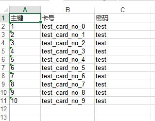

# onetwo-poi
基于poi，对操作excel的简单封装。

## maven ##
```xml

<dependency>
    <groupId>org.onetwo4j</groupId>
    <artifactId>onetwo-poi</artifactId>
    <version>4.6.1-SNAPSHOT</version>
</dependency>   

```

## 使用 ##
### 定义xml模板
excel_template.xml:   
```xml

<?xml version="1.0" encoding="UTF-8"?>
<template name="用户卡列表" columnWidth="2:30">
	<rows>
		<row span="2" fieldStyle="alignment:ALIGN_CENTER;verticalAlignment:VERTICAL_CENTER;" fieldFont="boldweight:BOLDWEIGHT_BOLD">
			<fields>
				<field value="'报名客户资料'" rowspan="2" colspan="4"/>
			</fields>
		</row>
		<row renderHeader="true" 
		      fieldHeaderStyle="alignment:ALIGN_CENTER;verticalAlignment:VERTICAL_CENTER;" fieldHeaderFont="boldweight:BOLDWEIGHT_BOLD"
		      name="element" type="iterator" datasource="#cardList" fieldFont="boldweight:BOLDWEIGHT_NORMAL;color:COLOR_RED"> 
			<fields>
				<field label="主键" name="id" dataType="java.lang.String"/>
				<field label="卡号" name="cardNo"/>
				<field label="卡密码" name="cardPwd" />
			</fields>
		</row>
	</rows>
</template>

```
- id如果是一个比较大的长整型数字的时候，导出excel的时候会变成科学记数的形式数字，这时可以用dataType指定为string类型，这个单元格就会设为string类型

### java代码

创建Java类Card：   

```Java

public class CardEntity {
	
	protected Long id;
	protected String cardNo;
	protected String cardPwd;
	
	//...getter and setter
}

```

使用TemplateGenerator生成excel：   
```Java

        
		List<CardEntity> cardList = LangOps.generateList(10, i->{
			CardEntity card = new CardEntity();
			card.setId(Long.valueOf(i));
			card.setCardNo("card_no_"+i);
			card.setCardPwd("password"+i);
			card.setStartTime(new Date());
			return card;
		});
		Map<String, Object> context = new HashMap<>();
		context.put("cardList", cardList);
		TemplateGenerator g = ExcelGenerators.createExcelGenerator("c:/excel_template.xml", context);
		String path = "c:/excel_generated.xls";
		g.write(path);

```


### 与spring mvc集成

[zifish](https://github.com/wayshall/onetwo) 提供了一个与spring mvc的集成实现，可通过简单的配置即可启用集成

```yaml
jfish.poi.exportView.enabled = true # 默认即为true
```

启用后：

1、编写xml模板放到项目的 META-INF/resources/excel-view/ 目录，比如excel_template.xml

​		模板编写参考[定义xml模板](#定义xml模板)

2、编写普通的spring mvc controller，并返回ModelAndView对象，其中ModelAndView的view路径为: excel_template，并把需要在template里用到的数据put到model里，大概代码如下：

```java
@RequestMapping(path="export", method=RequestMethod.GET)
public ModelAndView export(){ 
  List<CardData> cardList = userService.findList();

  return pluginMv("excel_template", 
                  "cardList", cardList,
                  // fileName 为导出的文件名称
                  "fileName", StringUtils.defaultValue(fileName, "人员列表"));
}
```

3、直接访问controller的url地址并加上jfxls后缀即可导出文件，如：http://localhost:8080/export.jfxls


### 读取excel为Java对象

excel模板如下：   


用poi模块读取此模板的数据为Java对象代码如下：

```Java
String path = "excel_template_path.xls";
List<CardEntity> cardList = WorkbookReaderFactory.createWorkbookReader(CardEntity.class, 1, 
											"主键", "id", 
											"卡号", "cardNo", 
											"密码", "cardPwd")
											.readFirstSheet(path);
		
```

### 流式读取api
上面那些看上去整得太复杂？   

4.7.3 后增加一个简单的流式api读取excel

```Java
ImportBatchVO batch = new ImportBatchVO();
WorkbookReaderFactory.streamReader()
		.readSheet(0).readSheet(0) //读取第一个表格
			//读取第1行作为标题
			.row(0).onData((row, index) -> {
				batch.setTitle(row.getString(1));
			})
			////读取第2行到结束
			.row(1).toEnd().onData((row, index) -> {
				DetailImportData detail = new DetailImportData();
				detail.setRealName(row.getString(0));
				detail.setUserName(row.getString(1));
				detail.setFee(row.getCellValue(2, BigDecimal.class));
				batch.dataList.add(detail);
			})
		.endSheet()
		.from(dataFile);//从哪个数据文件读取
```


