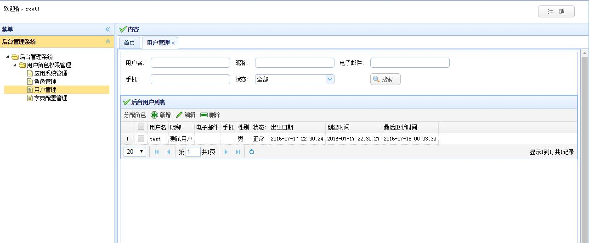

# web-admin后台管理插件
------
基于boot模块的插件机制，使用jquery-easyui编写的简单后台管理，包含了基本的权限管理和菜单功能。   
spring-boot技术交流群：  604158262

## 插件截图

## 配置
jfish: 
    security: 
        cookie: 
            path: ${server.contextPath} #设置cookies path
    plugin: 
        web-admin: 
            viewMapping: 
                /login: ~/login
                /admin: ~/admin
            captcha: 
                salt: ASDFA@GUythsdgasdf37890fghjkltyhj #验证码盐值，单实例部署时可不用配置，随机生成
                expireInSeconds: 180 #验证码有效期，默认大约三分钟